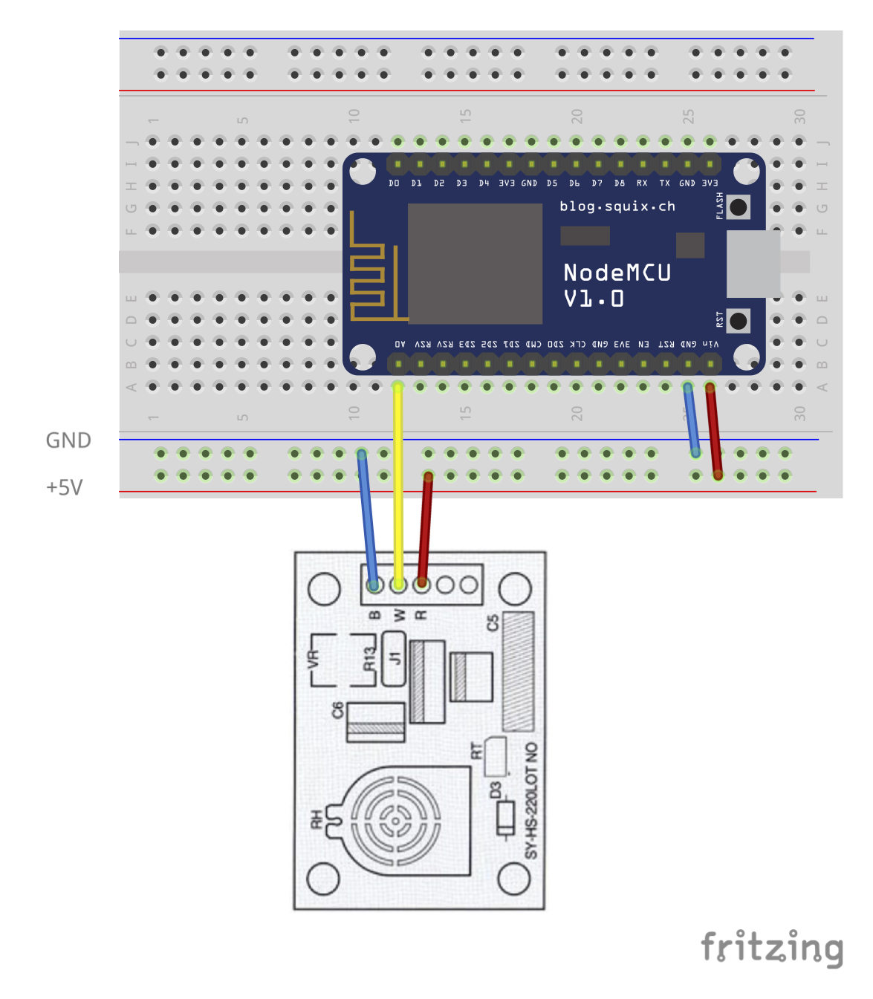

# humidity-syhs220-mqtt 

Periodically read value from humidity sensor SY-HS-220 and publish it to mqtt message broker.

## Wiring

**SY-HS-220** require 5V DC power. Unfortunetally in NodeMCU v1.0 there is no 5V pin, use additional DC +5V power supply.

