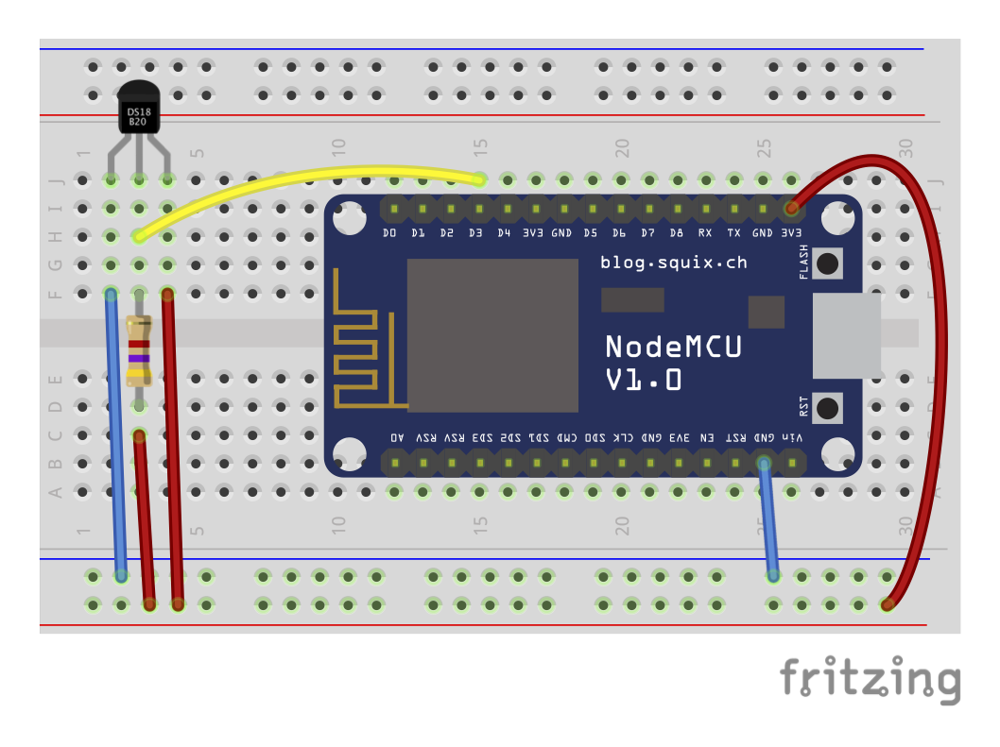
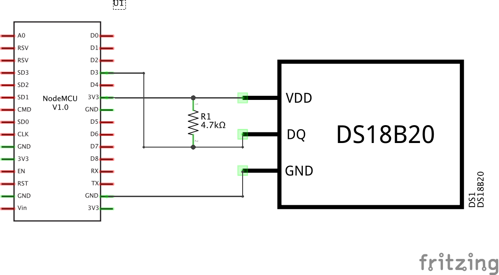

# temperature-ds18b20-mqtt 

Periodically read temperature from 1-Wire DS18B20 thermometer and publish to mqtt message broker. Readings from thermometer are handled by [DS18B20 lua module](https://github.com/nodemcu/nodemcu-firmware/tree/dev/lua_modules/ds18b20)

